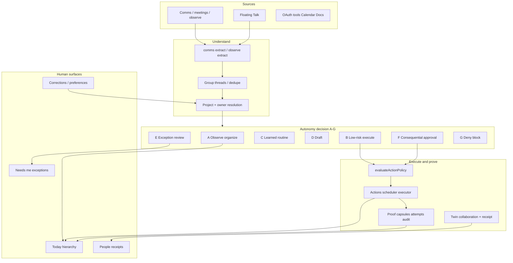

# OTZAR Autonomous Work OS — System Graph (Repository Truth)

**Date:** 2026-07-28  
**Mode:** Substrate-honest graph of *current* systems — not aspirational architecture  

## Mermaid (logical)

## Component → repo map

| Node | Path / service |
|------|----------------|
| Policy | `apps/api/src/services/action/policy-evaluator.ts` |
| Actions | `apps/api/src/services/action/*` |
| Collab | Twin collaboration routes + CT Collaboration.tsx |
| Today | `AmbientWorkSurface` + `founder-signal-hierarchy.ts` |
| Needs me | ActionCenter.tsx |
| Corrections | correction memory API + Preferences / Corrections pages |
| Org truth exceptions | OrgTruthReviewDrawer |
| Attention doctrine | `docs/product/OTZAR_HUMAN_ATTENTION_AND_AUTONOMY_MODEL.md` |

## Future communication layer (readiness only)

Bounded readiness note — **not built this release**:

- Work-only messaging linked to users, org, AI Teammates, phone identity  
- Must inherit PATH A–G (no ungoverned agent chat)  
- Status: **PARTIAL readiness** (identity + collab envelope exist; full messaging product deferred)

## Anti-patterns (explicit)

- Approval occupation for every extract  
- Silent authority expansion via “learning”  
- Fake second approver for dual-control  
- Leading Today with raw communication counts  
