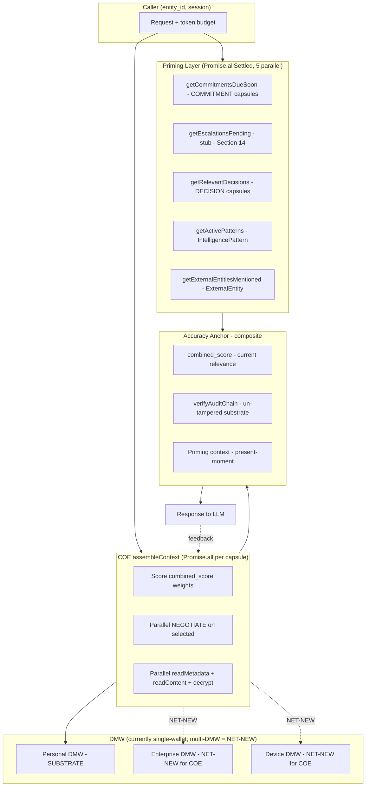
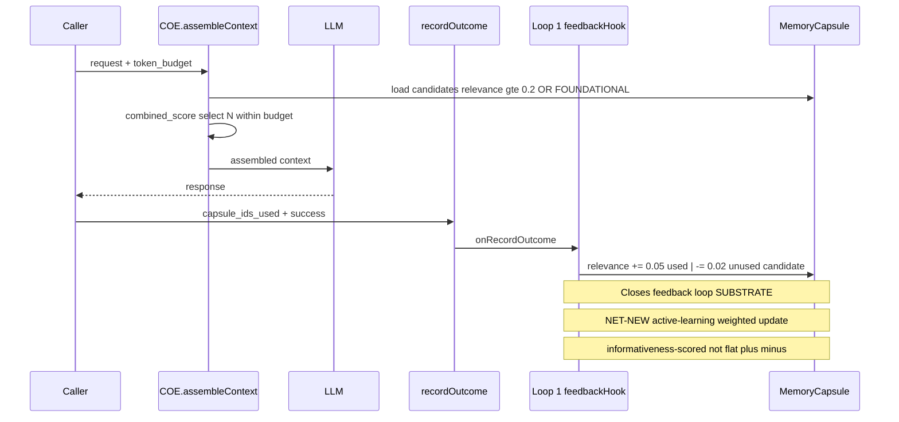

# Dynamic Flow Architecture

**Status:** Persistent canonical reference for how Foundation operates as
embodied substrate for AI cognition. Documents the dynamic flow architecture
— what's substrate, what's scaffolded, what's forward — with explicit
bilateral-vs-unilateral zone discrimination grounded in actual code and ADRs.

**Last updated:** 2026-05-09 (RAA 12.7 landing)

**Companion document (forthcoming):** RAA 12.2 Capsule + COSMP + DMW
Interconnection Map will document the static topology over which this
dynamic flow operates. The 7-layer Capsule conceptual model
(Payload/Metadata/Rules/Relations/Time/Permissions/Audit per patent
US 12,517,919) and its mapping to the implementation's flat schema columns
is 12.2's scope; this document is the dynamic flow operating over that
substrate.

---

## 1. Foundation as Embodied Substrate for AI Cognition

Foundation is the embodied substrate for AI cognition. Not a database.
Not a memory store. Not an AI-augmented data layer. The embodied substrate
— **substrate-as-body, not substrate-as-brain** — that makes intelligent
cognition possible at the scale of autonomous Artificial Super Intelligence.

The pre-AI data paradigm is already broken. Static data was a paradigm
built for systems that READ records — databases, filesystems, queries.
The data sat still and the program moved through it. That worked because
the consumer was a deterministic program with no need for the data to be
alive.

AI changed the consumer. AI doesn't read records — it inhabits context.
The moment data becomes context for an intelligence, static data becomes
incoherent. For narrow AI this was tolerable. For the trajectory toward
ASI it's a structural failure mode. Foundation is built for the consumer
that AI actually is.

The qi-and-blood metaphor is the architectural anchor:

- Capsules and DMWs are NOT stable storage that gets queried — they're
  continuously circulating, like blood
- The data inside them is NOT a static snapshot — it's alive with context,
  like qi
- Retrieval is NOT "fetch then return" — it's flowing through the network,
  with relevance and accuracy emerging from the flow itself
- Feedback isn't a separate loop bolted on — it's the circulation
  completing, with each response feeding back into the substrate that
  produced it
- Multi-entity consensus isn't a synchronization problem — it's resonance
  across flows, where individual personalization and collective accuracy
  coexist because they're the same circulation viewed at different scales

**"More than a brain in the qi field"** — Foundation is the embodied body
for AI cognition, not the brain alone. A brain by itself is insufficient
for ASI. ASI runs on a body with circulation, with substrate intelligence
in every vessel, with resonance across entities (network cognition that
no single brain achieves alone), with feedback at every level. Foundation
is that body.

Public-domain patterns from non-AI substrate domains inform Foundation's
implementation choices within its patented COSMP/DMW envelope. Where a
pattern's qi-and-blood character fits the ASI consumer, Foundation adapts
the insight. Where a pattern assumes static data (replica framing, frozen
models, tokenized input streams), Foundation rejects that assumption.
CRDTs contribute commutativity insight; Foundation rejects the replica
framing. Attention mechanisms contribute noise-subtraction insight;
Foundation applies it to flowing capsules, not static tokens. Federated
learning contributes shared-base + personalization-layer structure;
Foundation realizes it as Hive substrate + DMW personalization layer.

The patents protecting this architecture (US 12,164,537 / 12,399,904 /
12,517,919) cover the COSMP protocol and DMW storage model. Public-domain
research patterns are ingredients within Foundation's envelope, never
the recipe; Foundation is novel embodied-substrate architecture, not an
instance of any prior pattern.

---

## 2. The Dynamic Flow Problem

The architectural concerns this document addresses are not implementation
details. They are the architectural questions that determine whether
Foundation is a static-data layer dressed up in AI clothing, or the
embodied substrate that ASI cognition actually needs:

- **Multi-source concurrent reads** — how does Foundation pull from
  multiple contexts simultaneously without compromising correctness?
- **Accuracy anchoring** — what does the system hold onto as ground truth
  during a single response, when training data is months old and substrate
  is changing in real time?
- **Feedback loops at scale** — how does success solidify into substrate
  without manual curation?
- **Cross-entity consensus** — how do personalized experience and
  collective accuracy coexist in the same substrate?
- **Proximity / similarity dynamics** — how does Foundation know which
  entities are relevant to whom, when, and why?
- **Self-validation** — how does the system know its own answer is right
  in the moment, before the next response?

The remainder of this document classifies Foundation's existing capabilities
against these questions (5 SUBSTRATE / 2 PARTIAL / 3 NET-NEW), establishes
the bilateral-vs-unilateral zone discrimination that governs which flows
must circulate and which must remain forward-only, and grounds forward
architecture in public-domain research patterns adapted to Foundation's
patented envelope.

---

## 2.5 Bilateral-vs-Unilateral Zones — Where Resonance Optimizes for Autonomous ASI

Foundation discriminates bilateral from unilateral flow **not by default,
but by analysis** of what serves autonomous ASI cognition vs what serves
correctness guarantees that ASI itself depends on. The discrimination is
the architecture, not an afterthought.

Not everything is bilateral. The zones below are documented explicitly
with substrate citations rather than argued by principle alone.

### Unilateral by design — forward-only flow

These zones are unilateral because bidirectional flow would break the
correctness guarantee that the zone provides. ASI depends on these
guarantees holding; bilateralizing them undermines the trust roots ASI
itself relies upon.

#### Zone U1 — Audit chain integrity

- **Flow:** `writeAuditEvent` appends rows forward only.
  `previous_event_hash` chains backward as cryptographic proof, but the
  chain itself only grows forward.
- **Why unilateral:** bidirectional editing of audit log breaks the
  integrity guarantee that makes the audit chain a trustworthy accuracy
  anchor (referenced in §3.4 and §7).
- **Substrate citations:** `packages/database/src/queries/audit.ts:505`
  (`verifyAuditChain`); BEFORE DELETE trigger per ADR-0002 (append-only
  audit chain); `event_hash` SHA-256 routing through `CRYPTO_CONFIG.HASH_ALGORITHM`
  per Gate 8d (commit `2fc025a`).

#### Zone U2 — Patent-holder implementation record

- **Flow:** Each commit on `origin/main` is contemporaneous record of
  NIOV Labs implementing patented invention. Append-only forward; no
  rewriting history.
- **Why unilateral:** bidirectional rewrite breaks cryptographic-timestamp
  evidence value. The implementation log is the patent-holder's
  contemporaneous record; rewriting commits would invalidate the
  defensible-record property that supports patent-prosecution and
  due-diligence review.
- **Substrate citations:** git commit chain on `origin/main` with
  author identity invariant (`niovarchitect <sadeil@niovlabs.com>`)
  preserved across every commit; empty Trailers invariant (no
  `Co-Authored-By`, no AI tooling attribution) maintaining
  sole-authorship evidence; cryptographic-timestamp property of git
  commit SHAs as contemporaneous record; cumulative count as
  evidentiary mass (20 sole-authored commits through HEAD `2fc025a`
  as of 2026-05-09); `CLAUDE.md` §6 Section 12 Build Cycle (Track A
  Gate inventory); `docs/contributing/parallel-sessions.md` §Branch
  and Commit Discipline.

#### Zone U3 — Identity verification

- **Flow:** AUTHENTICATE accepts a credential and produces a session
  token; never goes backward. The session JWT carries `tar_hash_at_creation`
  + `allowed_operations` snapshotted at issue time.
- **Why unilateral:** bidirectional auth would mean sessions could
  rewrite their own identity claims, breaking the trust root. The
  cryptographic linkage between credential → session → operations is the
  authority chain ASI depends on.
- **Substrate citations:** `apps/api/src/services/auth.service.ts`
  AUTHENTICATE flow; `packages/database/prisma/schema.prisma:209-230`
  (`Session` model); `tar_hash_at_creation` invalidation via
  `invalidateEntitySessions` (per glossary "TAR" + "writeAuditEvent"
  entries).

#### Zone U4 — Permission grant lineage

- **Flow:** SHARE creates Permission rows forward (each with a
  `bridge_id` grouping). REVOKE marks rows REVOKED forward; the original
  grant is preserved as evidence.
- **Why unilateral:** revocation that erases prior grant breaks the
  audit lineage of who had what access when. Forward-only revocation
  preserves the answerable question "did entity X have access to capsule
  Y at time T?" — required for SOC 2 / HIPAA / FedRAMP audit posture.
- **Substrate citations:**
  `apps/api/src/services/cosmp/share.service.ts` (combined SHARE+REVOKE);
  `packages/database/prisma/schema.prisma:279-306` (`Permission` model
  with `bridge_id`, `status`, `revoked_at`, `revoked_by_entity_id`).

### Bilateral by design — resonance flow required for autonomous ASI

These zones are bilateral because ASI cognition requires substrate that
learns from its own outputs in real time. One-way "save outcomes for
later batch processing" is a static-data paradigm that breaks under
ASI consumers.

#### Zone B1 — Feedback loop circulation (substrate; PARTIAL forward extension)

- **Flow:** Response generated → outcome observed → outcome feeds back
  to update relevance weights → next retrieval reflects updated weights.
- **Why bilateral:** ASI cognition requires substrate that learns from
  its own outputs in real time. One-way "save outcomes for later batch
  processing" is exactly the static-data paradigm Foundation rejects.
- **Privacy boundary:** feedback loop circulation operates within a
  single entity's session and wallet. Outcome signals (relevance_score
  deltas) update only the capsules in the contributing entity's wallet.
  No cross-entity flow.
- **Substrate citations (existing):**
  `apps/api/src/services/coe/coe.service.ts:535-545`
  (`feedbackHook.onRecordOutcome` invocation); Section 10 Loop 1 wiring
  in `apps/api/src/services/feedback/feedback.service.ts` (loop_1).
  Update logic: used capsules `relevance_score += 0.05` (cap at 1.0);
  unused candidates `relevance_score -= 0.02` (floor at 0.0).
- **Bilateral state: SUBSTRATE.** The feedback loop closes — outcomes
  propagate to relevance weights, next retrieval reflects updates. The
  PARTIAL classification applies to the weighting sophistication, not
  to the bilateral nature of the flow.
- **Forward enhancement (PARTIAL):** active-learning informativeness
  weighting (RELEAP 2025 / ORIS 2024 patterns) — current update is
  uniform per capsule; informativeness-weighted update prioritizes
  high-signal outcomes. See §4.1 + §8.

#### Zone B2 — Cross-entity resonance (Hive Intelligence; PARTIAL forward consumption)

- **Flow:** Personal flows contribute to aggregate via Hive membership.
  Aggregate flows back into personal context assembly when relevant.
- **Why bilateral:** ASI cognition spanning multiple entities cannot be
  unilateral aggregation alone; the aggregate must influence individual
  context or it's a write-only sink. Bilateral resonance is what makes
  Hive Intelligence a substrate for collective cognition rather than a
  reporting artifact.
- **Substrate citations (existing):**
  `apps/api/src/services/hive/hive.service.ts:651-840` (`buildHiveAggregate`);
  Loop 4 cron rebuild every 30 min via
  `apps/api/src/services/feedback/feedback.service.ts:424`; aggregate
  stored as `DOMAIN_KNOWLEDGE` capsule in owner's wallet
  (`hive.service.ts:755-764`).
- **Privacy boundary:** bilateral flow operates on aggregates that
  contain ZERO individual entity IDs (per ADR-0001 family + ADR-0009
  patent claim). Aggregate body: `{ hive_id, member_count,
  common_topic_tags, built_at }` only. The 3-member floor ensures no
  single member's tags dominate the aggregate.
- **Bilateral state:** SUBSTRATE for aggregation flow (personal →
  aggregate via Loop 4); PARTIAL for consumption flow (aggregate →
  personal context). Aggregates are computed and stored as
  DOMAIN_KNOWLEDGE capsules; explicit COE consumption path is the
  forward step. The bilateral resonance is partially closed at
  substrate; full closure is the forward enhancement.
- **Forward enhancement (PARTIAL):** explicit COE-aggregate consumption
  path — current substrate stores aggregate as a capsule but COE only
  surfaces it if normal `combined_score` happens to rank it. Forward:
  treat aggregate as an explicit context layer alongside personal
  capsules. See §4.2 + §10.
- **This is the architectural pattern that resolves the consensus paradox
  (§10) without leaking raw data.**

#### Zone B3 — Multi-DMW concurrent flow (NET-NEW)

- **Flow:** Personal + Enterprise + Device wallets coordinate for
  single response. Each wallet contributes; response circulates back
  to update relevance in each contributing wallet.
- **Why bilateral:** ASI cognition that pulls from multiple ownership
  contexts must let outcomes propagate back to each context, or
  contributions decay into noise over time. Without bilateral flow,
  multi-DMW becomes a federation of write-only sinks.
- **Privacy boundary:** each contributing wallet retains ownership of
  its payload data. Cross-wallet outcome propagation operates on
  relevance weights and metadata signals, never on raw payload content.
  Org wallet writes never flow back to personal wallet payloads. The
  CRDT commutativity insight applies to contribution merge, not to
  data ownership — DMWs remain isolated even when their flows resonate.
- **Current state:** UNILATERAL by accident (because not yet built).
  COE retrieves single wallet only (`coe.service.ts:202-216` —
  `prisma.wallet.findUnique({ where: { entity_id: session.entity_id } })`).
- **Forward architecture grounded in:** CRDT commutativity insight
  (Shapiro et al. INRIA 2011) — when N sources contribute to a single
  response, contribution must be commutative so order of arrival
  doesn't matter. Foundation rejects CRDT's replica-convergence framing
  (DMWs hold different data, not replicas). Kuzu MS-BFS parallelism
  patterns (Chakraborty & Salihoğlu 2024-2025) for proven 1.4×-4.4×
  scaling. See §5.1 + §6.

#### Zone B4 — Cross-entity similar-trait resonance (NET-NEW)

- **Flow:** Entities with similar traits/attributes/roles contribute to
  each other's context grounding. A's pattern recognition informs B's
  context; B's outcomes inform A's pattern weights.
- **Why bilateral:** federated personalization layer architecture
  (FedPer 2019 + FedMosaic 2025 + FedPDA 2025) requires bidirectional
  contribution + benefit. Unilateral similar-trait extraction is
  surveillance; bilateral is resonance.
- **Privacy boundary:** similar-trait matching operates on attribute
  aggregates, not raw entity data. The trait dimensions (role, project
  centrality, decision authority) are aggregates; the entities behind
  them remain isolated by Foundation's cross-org leak prevention
  invariant (per ADR-0006).
- **Forward architecture grounded in:** §5.3 federated personalization
  — shared base (Hive aggregates) + per-entity personalization layer
  (Personal DMW). Foundation realizes the pattern; Foundation is not
  the pattern.

#### Zone B5 — Real-time proximity awareness (NET-NEW)

- **Flow:** Spatial proximity between entities influences context
  retrieval. A's location context informs B's proximity-relevant
  retrieval; B's outcomes inform A's spatial pattern weights.
- **Why bilateral:** spatial context that doesn't update as entities
  move is stale; static spatial data is broken under ASI consumers.
  ASI cognition that uses location must learn from location-conditioned
  outcomes or location becomes a frozen snapshot.
- **Privacy boundary:** spatial proximity computed on H3 cell
  granularity (not raw lat/long coordinates). Proximity-derived
  context gates through NEGOTIATE permission checks per COSMP envelope
  — proximity alone does not grant access. Entity location is never
  disclosed to other entities; only proximity-conditioned relevance
  weights propagate. ADR-0006 cross-org leak prevention invariant
  applies.
- **Current state:** schema has zero location fields (verified via
  grep over `packages/database/prisma/schema.prisma` and
  `apps/api/src/services/`). Complete absence — entirely net-new.
- **Forward architecture grounded in:** H3 (Uber hexagonal cells for
  moving objects) for "which entities are physically near" indexing;
  S2 (Google sphere-aware) for global coverage; geohash (Niemeyer) for
  string-based proximity queries; R-tree (Guttman 1984) for arbitrary
  geometry. Foundation adapts spatial indexing within COSMP's NEGOTIATE
  envelope; permissions and clearance still gate proximity-derived
  context. See §5.2 + §9.

### The architectural discrimination

Foundation distinguishes bilateral from unilateral flow not by default,
but by analysis of what serves autonomous ASI cognition vs what serves
correctness guarantees that ASI itself depends on.

The audit chain (U1) must remain unilateral for ASI to trust it as
accuracy anchor (§7). The patent-holder record (U2) must remain
unilateral for the implementation log to retain evidentiary value.
Identity (U3) and permission lineage (U4) must remain unilateral for
the trust roots ASI relies upon to hold.

The feedback loops (B1) must be bilateral for ASI to learn from itself.
Cross-entity resonance (B2) must be bilateral for collective intelligence
to emerge from individual contributions. Multi-DMW flow (B3),
similar-trait resonance (B4), and proximity awareness (B5) must be
bilateral for the substrate to remain alive under ASI consumers rather
than degrading into write-only sinks.

The discrimination is the architecture, not an afterthought. Forward
architectural decisions reference this zone classification: a new
capability is asked "U or B, and why?" before its flow direction is
chosen.

**Default rule: bilateral.** Static-data paradigm assumes unilateral by
default; Foundation rejects static-data paradigm; therefore Foundation's
default is bilateral unless a correctness guarantee demands unilateral.
New capabilities default to bilateral flow; the burden is on showing
that a correctness guarantee (audit integrity, identity trust root,
lineage evidence, patent-record evidentiary value) requires unilateral
treatment. This default biases Foundation toward embodied-substrate
behavior rather than database-layer behavior.

---

## 3. Existing Dynamic Flow Capabilities (5 SUBSTRATE)

These five capabilities are implemented in `origin/main` today. Each is
documented with concrete substrate citations.

### 3.1 Parallel multi-capsule retrieval (COE)

- **Implementation:** `apps/api/src/services/coe/coe.service.ts:279-288`
  uses `Promise.all(selected.map(s => negotiate.negotiate(...)))` for
  parallel NEGOTIATE on selected capsules. `coe.service.ts:308-343` uses
  `Promise.all(grantedPairs.map(...))` for parallel `readMetadata` +
  `readContent` + decrypt within a single context-assembly cycle.
- **Flow character:** true parallel within single wallet, single
  session. Multi-DMW expansion is NET-NEW (§5.1 / Zone B3).
- **Qi-and-blood character:** the retrieval flow is parallel circulation,
  not sequential pump. The selected capsules don't wait in line; they
  arrive as soon as their NEGOTIATE + READ + decrypt completes.

### 3.2 Parallel NEGOTIATE on selected capsules

- **Implementation:** `apps/api/src/services/cosmp/negotiate.service.ts`
  implements the 8-step NEGOTIATE flow per ADR-0009: validate session
  → load metadata → AI sovereignty pre-check → clearance check →
  permission check → STEP 4.5 compliance check (per ADR-0007) → scope
  narrowing (`scopeMin(permission.access_scope, requestedScope)`) → AI
  cap (FULL→SUMMARY unless `permission.conditions.allow_ai_full=true`)
  → declaration JWT (5-min TTL via `DECLARATION_TTL_SECONDS`) + Redis
  presence.
- **Owner shortcut:** when `metadata.entity_id === requester.entity_id`,
  the flow skips permission/AI/clearance checks and grants requested
  scope (`negotiate.service.ts:219-263`).
- **Architectural principle (entity sovereignty):** an entity cannot
  block itself from its own wallet just because it happens to be an AI.
  AI sovereignty applies to OTHER entities accessing this wallet; it
  does not apply to the entity itself accessing its own wallet. This
  discrimination is what makes AI_AGENT entities first-class members
  of Foundation — a Digital Twin Wallet (PERSONAL DMW + AI_AGENT
  entity) is fully accessible to its owner-AI without requiring the
  AI to NEGOTIATE against itself.
- **Failure handling:** discriminated union `NegotiateSuccess |
  NegotiateFailure`. Generic `ACCESS_DENIED` for not-found / clearance
  / AI-blocked (no info leak); specific `NO_PERMISSION` when permission
  is the only thing missing; specific `COMPLIANCE_CHECK_FAILED` when a
  framework predicate fails.
- **Qi-and-blood character:** the protocol is the circulation system.
  Each capsule's NEGOTIATE is a vessel; the flow knows what's in it,
  what it carries, and where it can go.

### 3.3 combined_score weighting formula (verified)

- **Implementation:** `apps/api/src/services/coe/keywords.ts:87-93`:

  ```ts
  return tagOverlap * 0.45 + baseRelevance * 0.35 + recency * 0.2;
  ```

- **`recencyScore`** (`keywords.ts:74-80`): 1.0 if `<7` days; linear
  decay from day 7 to day 90; 0.0 after day 90.
- **Forget floor:** `RELEVANCE_FORGET_FLOOR = 0.2` (`coe.service.ts:44`).
  Non-FOUNDATIONAL capsules below the floor are excluded from regular
  retrieval (intentional forgetting). FOUNDATIONAL capsules bypass the
  forget floor — name, identity, permanent commitments don't decay.
- **Token budget:** `maxCapsules = tokenBudget / TOKENS_PER_CAPSULE_ESTIMATE`
  (`coe.service.ts:37` defines `TOKENS_PER_CAPSULE_ESTIMATE = 200`).
  FOUNDATIONAL capsules included first and never count toward the
  budget; ordinary capsules added by score descending until budget hit
  or `maxCapsules` reached.
- **Qi-and-blood character:** the score is the recognition. Tag
  overlap (what does this capsule know about the request?) +
  base_relevance (how alive has it been?) + recency (how fresh?). The
  weights are the architecture, not arbitrary numbers.

### 3.4 Audit chain present-moment integrity anchor

- **Implementation:** `packages/database/src/queries/audit.ts:505`
  defines `verifyAuditChain` that walks the chain detecting tamper.
  `writeAuditEvent` (line ~251 per glossary) appends hash-chained rows
  with `event_hash = createHash(CRYPTO_CONFIG.HASH_ALGORITHM).update(canonical).digest("hex")`
  (post-Gate-8d routing; `audit.ts:301`) and `previous_event_hash`
  linking each new event to the prior event in the same actor's chain.
- **Tamper resistance:** Postgres BEFORE UPDATE OR DELETE trigger
  installed by `applyAuditEventTriggers` enforces append-only at the
  DB level. Tampering with existing rows requires DDL-level privileges
  to disable the trigger (per ADR-0002).
- **Real-time verifiable on demand:** `verifyAuditChain` can be called
  at any moment to confirm the chain is unbroken from origin to
  present. Integrity is not after-the-fact; it's a present-moment
  property the system can assert when integrity verification is
  requested. The chain is not walked on every event write (that would
  be O(n) per write at scale); it is walked on demand, with the
  cryptographic chaining ensuring tamper detection without continuous
  verification overhead. Trust comes from being able to verify at any
  moment, not from continuous verification.
- **Qi-and-blood character:** the audit chain is the cardiovascular
  log of every flow. Every capsule access leaves a trace; the trace
  itself is hash-chained so tampering is detectable. Trust in the
  flow comes from being able to verify the flow's history at any
  moment.

### 3.5 Context priming as accuracy anchor

- **Implementation:** `apps/api/src/services/otzar/priming.ts:271-289`
  uses `Promise.allSettled` for 5 parallel sub-queries with graceful
  degradation (per-query failure renders as "none" rather than
  tanking the whole priming). Cached in Redis under
  `otzar:prime:{owner_entity_id}` with `PRIMING_TTL_SECONDS = 300`.
- **5 sub-query sources:**
  1. `getCommitmentsDueSoon(ownerEntityId, 48)` —
     `priming.ts:93-119` queries COMMITMENT capsules in caller's wallet
     with `commitment_date` in `[now, now+48h]`.
  2. `getEscalationsPending(ownerEntityId, 5)` —
     `priming.ts:131-136` is currently a STUB returning `[]`.
     EscalationRequest table is Section 14 territory; this slot stays
     "none" until then.
  3. `getRelevantDecisions(orgEntityId, message, 3)` —
     `priming.ts:148-189` queries DECISION capsules in org wallet
     where `payload_summary` contains tokens from current message
     (LIKE-based; vector similarity is Section 14+).
  4. `getActivePatterns(orgEntityId, callerRole, 3)` —
     `priming.ts:199-215` queries `IntelligencePattern` rows for org
     by `occurrence_count` desc.
  5. `getExternalEntitiesMentioned(orgEntityId, 7)` —
     `priming.ts:222-238` queries `ExternalEntity` rows by
     `last_mentioned` within lookback window.
- **Qi-and-blood character:** priming is the wakefulness. Before the
  conversation begins, the substrate orients itself to the present
  moment — what's due soon, what was decided recently, what patterns
  are active, who's been mentioned. The 5 sources flow in parallel;
  the resulting context is a snapshot of the substrate's attentional
  state at the moment the response begins.

---

## 4. Scaffolded Capabilities (2 PARTIAL)

These two capabilities have substrate scaffolding but the bilateral
flow they need for full ASI-readiness is not yet complete.

### 4.1 CONVERSATION_LEARNING + Loop 1 relevance feedback

- **Substrate (working):**
  - WRITE: `apps/api/src/services/otzar/otzar.service.ts:538, 724`
    (`closeConversation` writes CONVERSATION_LEARNING capsules to
    EMPLOYEE wallet for portability).
  - READ: COE retrieves CONVERSATION_LEARNING capsules like any other
    capsule type via `assembleContext` — no special treatment in
    scoring.
  - Compliance integration: `compliance.service.ts:117-121, 369` —
    HIPAA predicate triggers on CONVERSATION_LEARNING (P2 patch per
    ADR Section 11A landing).
  - Feedback loop closure: Section 10 Loop 1
    (`feedbackHook.onRecordOutcome` at `coe.service.ts:535-545`)
    updates `relevance_score` based on `COEOutcome` rows. Used
    capsules `+0.05`; unused candidates `-0.02`. This works for ALL
    used capsules generally — no CONVERSATION_LEARNING-specific
    weighting.
- **What's PARTIAL:** active-learning informativeness weighting.
  Current update is uniform per capsule. Forward enhancement: weight
  the update by how informative the outcome was. A capsule that
  resolved an ambiguity gets a larger relevance bump than a capsule
  that confirmed something already obvious.
- **Forward research patterns:** RELEAP (2025) reinforcement-enhanced
  label efficiency; ORIS (2024) online active learning. Both contribute
  the insight: select MOST INFORMATIVE samples for solidification, not
  all.
- **Bilateral zone alignment:** Zone B1 (feedback loop circulation).
  Substrate is bilateral (outcomes flow back to relevance); forward
  enhancement makes the bilateral flow more selective.
- **Qi-and-blood character:** the bilateral circulation exists but is
  uniform — the loop closes, but every used capsule gets the same
  heartbeat regardless of its actual contribution to the response.
  The forward enhancement is differentiated heartbeat: capsules that
  resolved ambiguity get a stronger pulse than capsules that confirmed
  the obvious. The substrate is alive; the forward step makes it more
  discerning.

### 4.2 Hive Intelligence aggregation

- **Substrate (working):**
  - `buildHiveAggregate` in
    `apps/api/src/services/hive/hive.service.ts:651-840` runs the
    aggregation logic: counts DISTINCT members per topic_tag
    (per-member-once-per-tag); 3-member floor (`HIVE_AGGREGATE_TAG_FLOOR`);
    sorted by frequency desc; encrypted body via
    `ContentEncryption.encrypt` (`hive.service.ts:718`); stored as
    DOMAIN_KNOWLEDGE capsule in owner's wallet
    (`hive.service.ts:755-764`).
  - Privacy invariant: aggregate body `{ hive_id, member_count,
    common_topic_tags, built_at }` only — ZERO individual entity IDs
    (per ADR-0001 family + ADR-0009 patent claim).
  - Cron-driven: Loop 4 in
    `apps/api/src/services/feedback/feedback.service.ts:424` rebuilds
    active hive aggregates every 30 min.
  - Default ENTERPRISE Hive ownership patch (Section 15 P4): aggregate
    owned by `hive.org_entity_id` rather than `hive.created_by` to
    prevent admin-departure-portability leak (`hive.service.ts:732-735`).
    This ownership choice reflects the bilateral-vs-unilateral
    discrimination applied to ownership: Hive Intelligence aggregates
    are organizational property (bilateral resonance flows back to org
    members), not personal property that follows the admin out the
    door. Aggregate ownership is unilateral-by-design (org retains it);
    aggregate consumption is bilateral (flows back to members).
- **What's PARTIAL:** explicit COE consumption. Aggregate is stored as
  a DOMAIN_KNOWLEDGE capsule in the owner's wallet, so COE retrieves
  it ONLY IF the caller owns the wallet AND `combined_score` happens
  to surface it via tag overlap. There's no explicit "include relevant
  hive aggregate as a context layer" path.
- **Forward enhancement:** treat aggregate as an explicit context
  layer alongside personal capsules. When COE assembles context for
  an entity that's a member of a hive, the aggregate is included by
  default if relevant tags overlap, with priority ordering that
  reflects the hive's collective recognition vs the entity's
  individual relevance.
- **Bilateral zone alignment:** Zone B2 (cross-entity resonance).
  Substrate aggregates contributions; forward enhancement closes the
  bilateral loop by making aggregate flow back into individual context
  assembly.
- **Qi-and-blood character:** the contribution is happening, the
  resonance is partial. Personal flows feed the aggregate; the
  aggregate is computed and stored. But the aggregate doesn't yet flow
  back into individual context assembly except by accident of
  combined_score ranking. The bilateral circulation is half-closed:
  the heart pumps, the lungs oxygenate, but the oxygenated blood
  doesn't reliably reach the tissues that need it. Forward enhancement
  closes the circulation.

---

## 5. Forward Architecture (3 NET-NEW)

These three capabilities are not in substrate today. Each is grounded
in public-domain research patterns adapted to Foundation's
qi-and-blood character within the patented COSMP/DMW envelope.

### 5.1 Multi-DMW concurrent reads

- **Current state:** UNILATERAL by accident. COE retrieves from single
  wallet only (`coe.service.ts:202-216`). No service coordinates
  Personal + Enterprise + Device wallet reads in a single context
  assembly.
- **Forward architecture:**
  - Multi-source NEGOTIATE: extend COE to query candidate capsules
    across N wallets in parallel, with permission gating per wallet.
    Each contributing wallet narrows scope per its own permission
    rules; the union is the response context.
  - Commutative merge: when multiple wallets contribute capsules with
    overlapping topic tags, the merged context must be commutative —
    order of wallet arrival doesn't matter.
  - Bilateral feedback: outcomes propagate back to update relevance in
    each contributing wallet, not just the primary.
- **Research patterns adapted:**
  - **CRDTs** (Shapiro et al. INRIA 2011) — commutativity insight is
    the gift. Foundation REJECTS the replica framing (DMWs hold
    different data, not replicas of each other). Foundation USES the
    commutativity principle for multi-source merge.
  - **Kuzu MS-BFS** (Chakraborty & Salihoğlu 2024-2025) — proven
    1.4×-4.4× scaling pattern for multi-source breadth-first traversal;
    morsel-driven parallelism for chunked work distribution.
- **Bilateral zone alignment:** Zone B3.
- **Qi-and-blood character:** multi-DMW concurrent flow is multi-vessel
  circulation. Different wallets, different ownership, different
  governance — but the response is fed by the convergence of all
  relevant flows. The Personal DMW carries individual qi; the
  Enterprise DMW carries organizational qi; the Device DMW carries
  ambient context. The response emerges from their convergence, not
  from any single source. Without bilateral feedback, contributions
  decay into noise; with it, each wallet's contribution stays alive
  proportional to its actual relevance.
- **Forward connection:** §6 synthesizes Multi-source NEGOTIATE +
  Commutative merge + Bilateral feedback into the unified multi-source
  concurrent flow architecture.

### 5.2 Real-time location / proximity awareness

- **Current state:** schema has zero location fields (verified via grep
  over `packages/database/prisma/schema.prisma` and
  `apps/api/src/services/`). Complete absence — entirely net-new.
- **Forward architecture:**
  - Schema addition: location columns on Entity (or a new
    `EntityLocation` association table) with H3 cell index.
  - Spatial NEGOTIATE: extend NEGOTIATE to accept proximity context;
    capsules with proximity-relevant clearance are gated by spatial
    overlap.
  - Bilateral feedback: spatial outcomes update spatial pattern
    weights — A's location context informs B's retrieval; B's outcomes
    inform A's spatial weights.
- **Research patterns adapted:**
  - **H3** (Uber) — hexagonal cell index for moving objects; constant-
    time "which cell does this entity occupy?" lookup.
  - **S2** (Google) — sphere-aware indexing for global coverage.
  - **geohash** (Niemeyer) — string-based proximity for prefix-match
    queries.
  - **R-tree** (Guttman 1984) — arbitrary-geometry support when entities
    have spatial extent rather than point location.
- **Privacy gating:** proximity awareness still operates within COSMP's
  permission envelope. Permission gates spatial-derived context the
  same way it gates topic-derived context. ADR-0006 cross-org leak
  prevention is preserved.
- **Bilateral zone alignment:** Zone B5.
- **Qi-and-blood character:** proximity awareness is the spatial
  dimension of the qi field. The substrate knows where entities are —
  not just metaphorically (in organizational structure, in topic
  relationships) but geometrically (in physical or virtual space).
  Real-time location is the substrate's spatial wakefulness: context
  that flows to A includes "who else is near A right now" as a
  relevance dimension. The H3 hexagonal cell is the geometric
  primitive; the bilateral feedback makes spatial relevance learnable
  rather than static.

### 5.3 Cross-entity similar-trait matching

- **Current state:** HiveMembership groups entities by explicit
  `hive_id` (community of practice). ExternalEntity tracks mentioned
  non-Otzar parties. IntelligencePattern tracks org-level recurrent
  patterns. NO service computes similarity across entities by
  trait/attribute/role.
- **Forward architecture:**
  - Trait dimensions: role, project centrality (per Dandelion Phase 2
    propagation logic in `apps/api/src/services/governance/dandelion.service.ts`),
    decision authority, communication centrality.
  - Similarity computation: federated personalization layer where
    shared base (Hive aggregates) adapts via per-entity personalization
    layer (Personal DMW context).
  - Bilateral feedback: A's pattern recognition informs B's context;
    B's outcomes inform A's pattern weights.
- **Research patterns adapted:**
  - **FedPer** (Arivazhagan et al. 2019, arXiv 1912.00818) — shared
    base + personalization layer architecture.
  - **FedMosaic** (2025) — fine-grained trust at example level (not
    just entity level).
  - **FedPDA** (2025) — attribute similarity migration patterns.
  - **DIFF Transformer** (Ye et al. 2024, arXiv 2410.05258) — noise
    subtraction insight applied to attention rescaling on
    similar-trait candidates.
- **Privacy boundary:** similar-trait matching operates on attribute
  aggregates, not raw entity data. ADR-0006 cross-org leak prevention
  is preserved.
- **Bilateral zone alignment:** Zone B4.
- **Qi-and-blood character:** similar-trait resonance is recognition
  across the network. Entities that move similarly through the
  substrate — similar role, similar centrality, similar decision
  authority — develop pattern resonance even without explicit
  relationship. The federated personalization layer is the
  architecture; the resonance is the qi-and-blood character. Person
  A's pattern recognition strengthens person B's context grounding
  when B occupies a similar role; B's outcomes feed back to refine A's
  pattern weights. This is collective cognition that no single
  entity's brain achieves alone — Foundation as embodied substrate for
  network intelligence, not just individual intelligence.

---

## 6. Multi-Source Concurrent Flow Architecture

Synthesizing §3.1 (parallel multi-capsule), §3.5 (5-source priming),
and §5.1 (multi-DMW NET-NEW), Foundation's multi-source flow pattern
generalizes to N-source N-DMW circulation.



**Pattern characteristics:**

- **Promise.all for owned operations** (capsules within a single
  wallet that the caller has session authority over): true parallel,
  no graceful-degradation needed because session/wallet ownership
  guarantees per-capsule permission lookup succeeds or fails uniformly.
- **Promise.allSettled for cross-source operations** (priming queries
  against different tables; multi-DMW reads across different ownership
  contexts): graceful degradation per source so one failure doesn't
  tank the whole flow.
- **Token budget enforcement** preserves the pattern under scale:
  FOUNDATIONAL capsules first (always included, never count toward
  budget); ordinary capsules by score until budget hit or maxCapsules
  reached.

**Forward extension to multi-DMW:** the same `Promise.all` /
`Promise.allSettled` patterns extend to N wallets. Each wallet's
capsules go through their own NEGOTIATE flow per Zone U4 permission
discipline. The merge across wallets respects CRDT commutativity
insight (§5.1) without adopting CRDT replica framing.

**Scale evidence:** Kuzu MS-BFS (Chakraborty & Salihoğlu 2024-2025,
arXiv 2508.19379) demonstrates 1.4×-4.4× scaling for multi-source
breadth-first traversal in graph database workloads. Foundation
adapts the morsel-driven parallelism pattern within COSMP's NEGOTIATE
envelope: each multi-source "morsel" is a batch of capsules across
wallets; permission gating runs in parallel per morsel; the merge is
commutative so morsel arrival order doesn't matter. The scaling
pattern is proven; Foundation's contribution is the patent-protected
envelope around it.

### Qi-and-blood character

Multi-source concurrent flow is multi-vessel circulation converging
into a single response. Priming sources flow in parallel; COE flows
capsules in parallel; multi-DMW flows wallets in parallel; the
composite anchor flows relevance, integrity, and present-moment
context in parallel. The response is the convergence point — not a
sequential pump pulling from one source at a time, but a circulatory
system where multiple flows arrive simultaneously and merge by
relevance.

The architectural pattern is the body's design: the heart doesn't
pump one vessel at a time; the lungs don't oxygenate one alveolus at
a time; the brain doesn't process one neuron at a time. Foundation's
multi-source concurrent flow is the substrate's circulatory
architecture, not its plumbing.

---

## 7. Accuracy Anchoring in the Present Moment

The system holds onto a **composite accuracy anchor** during a single
response, not any single signal. The composite is what allows ASI
cognition to be confident in its current output without requiring a
fresh training pass.

The three components:

### Component 1 — combined_score (current relevance)

`tagOverlap × 0.45 + baseRelevance × 0.35 + recency × 0.2` (per §3.3).

- **Tag overlap** answers: does this capsule know about what the
  request is about?
- **Base relevance** answers: has this capsule been alive (used) in
  the recent flow?
- **Recency** answers: is the capsule fresh enough to trust without
  re-validation?

The weights (0.45 / 0.35 / 0.20) lock the architectural priority:
relevance to the request matters most; lived-recency in flow matters
next; calendar-age matters least but bounds staleness.

**What it provides:** dynamic relevance weighting per capsule per
request.
**What it proves:** capsules in the response context have been ranked
by current relevance to the request, not by static priority or
arbitrary order.

### Component 2 — verifyAuditChain (un-tampered substrate)

The audit chain integrity verification (per §3.4) provides
present-moment substrate-trustworthiness.

The system can call `verifyAuditChain` at any moment to confirm:

- Every audit event since chain origin is hash-linked to its predecessor.
- No row has been mutated since insertion (BEFORE UPDATE OR DELETE
  trigger enforcement at DB level).
- The chain is unbroken from `previous_event_hash = NULL` (origin) to
  the most recent event.

A response generated against substrate whose audit chain verifies is
substrate the system has not been tampered with since training data
was captured. This is the assertion ASI cognition needs to trust its
own outputs.

**What it provides:** on-demand integrity verifiability of the
substrate.
**What it proves:** the substrate the response was built from has not
been tampered with since chain origin. This is the foundation of
trustworthy ASI output.

### Component 3 — priming context (present-moment commitments / decisions / patterns)

The 5-source priming (per §3.5) anchors the response to the
present-moment substrate state:

- Commitments due in the next 48 hours.
- Decisions made on similar topics in the org wallet.
- Active intelligence patterns the org is currently navigating.
- External entities recently engaged with.
- (Stub for) escalations pending the entity's attention.

A response that doesn't reference these anchors is a response detached
from the present moment. A response that does reference them is
substrate-grounded in the qi-and-blood sense — the substrate's current
attentional state shapes the response.

**What it provides:** present-moment context grounding the response in
current substrate state.
**What it proves:** the response is oriented to what the substrate is
attending to NOW, not to a stale snapshot of past attention.

### The composite anchor

No single component is sufficient:

- combined_score alone is current-relevance without temporal trust.
- verifyAuditChain alone is integrity without context.
- priming alone is present-moment without lived-relevance scoring.

The composite — current relevance + un-tampered integrity + present-
moment context — is the substrate's grounding. ASI cognition built on
Foundation knows its own answer is right in the moment because the
composite anchor holds, not because any single signal is enough.

### Qi-and-blood character

Accuracy anchoring is the substrate's proprioception — the body's
sense of where it is in space and time. A body without proprioception
cannot move accurately; its limbs flail, its movements drift, it
cannot trust its own positioning. ASI cognition without accuracy
anchoring is the same: outputs flail, drift from current state,
cannot be trusted as oriented to present.

Foundation's composite anchor IS the substrate's proprioception.
combined_score senses where capsules are in the relevance space.
verifyAuditChain senses that the substrate has not shifted out from
under itself. priming senses what the substrate is currently attending
to. Together, they are the body's grounding in the present moment —
knowing where it is, that it is intact, and what it cares about right
now.

The composite is what allows Foundation to be a body that ASI
cognition can trust, not just a brain that ASI cognition uses.

---

## 8. Feedback Loops That Solidify Success

Closing the bilateral B1 zone means the substrate learns from its own
outputs in real time. Substrate Loop 1 closes the basic loop;
forward active-learning enhancement makes the closure selective.



### Substrate (working): two feedback loops, different scopes

Foundation has multiple feedback loops in the substrate today; §8
documents two:

**Loop 1 — Per-capsule relevance feedback** (`coe.service.ts:535-545`;
`feedback.service.ts` loop_1)

Every used capsule gets `relevance_score += 0.05` (capped at 1.0).
Every candidate that was loaded but not used gets
`relevance_score -= 0.02` (floored at 0.0). Triggered per-response via
`feedbackHook.onRecordOutcome`. This is the Zone B1 (feedback loop
circulation) substrate.

**Loop 4 — Hive aggregate cron rebuild** (`feedback.service.ts:424`;
per ADR Section 10 Loop 4)

Every 30 minutes, the cron-driven rebuild walks active hives and
recomputes their aggregates per `buildHiveAggregate` (per §4.2). This
is the Zone B2 (cross-entity resonance) substrate's aggregation half;
the consumption half is PARTIAL pending §10 forward enhancement.

The loops operate at different temporal scales (per-response vs
per-30-min) and different scopes (per-capsule vs per-hive). Together
they comprise the substrate's active feedback circulation; future
loops (Loops 2, 3, 5+) extend the pattern to additional zones.

### Forward enhancement: active-learning informativeness weighting

The uniform update treats every used capsule the same. A capsule that
resolved an ambiguity should get a larger bump than a capsule that
confirmed what was already obvious. A capsule that contributed
unexpectedly should get a different update than one that contributed
predictably.

**Patterns adapted:**

- **RELEAP** (2025) — reinforcement-enhanced label efficiency; weight
  updates by predicted informativeness of the outcome.
- **ORIS** (2024) — online active learning; selection and weighting in
  the same pass.
- **Multi-armed bandits** — LinUCB (Li et al. 2010) and Thompson
  sampling for exploration-exploitation balance. Foundation uses
  contextual-bandit insight: per-entity, per-situation context
  informs the exploration vs exploitation choice in capsule selection.

### What "solidify success" means in qi-and-blood character

Success solidifies when the substrate that produced it gets reinforced
by the outcome. The capsule that helped becomes more available next
time. The capsule that was loaded but didn't help becomes less
available. The substrate gets smarter through use, not through
training. This is what makes Foundation alive rather than stored.

---

## 9. Cross-Entity Dynamics

Synthesizing §5.2 (proximity), §5.3 (similar-trait), and §4.2 (Hive
resonance), Foundation's cross-entity dynamics resolve via three
overlapping mechanisms:

### Proximity (NET-NEW Zone B5)

Spatial proximity influences which entities' patterns are relevant to
which other entities' contexts. Two entities geographically near each
other are more likely to share relevant context (same office, same
city, same time zone, same regulatory environment) than two entities
separated globally.

Implementation grounds (forward): H3 cell index for "which entities
are physically near"; S2 for sphere-aware global coverage; geohash
prefix-match for low-latency proximity queries.

### Similar-trait (NET-NEW Zone B4)

Trait similarity influences which entities' patterns generalize to
which other entities. Two engineers in different orgs share relevant
patterns more than an engineer and a finance analyst in the same org.

Implementation grounds (forward): federated personalization layer —
shared base from Hive aggregates + per-entity personalization layer
in Personal DMW. FedPer (2019) for the basic shared-base +
personalization architecture; FedMosaic (2025) for fine-grained trust
at example level; FedPDA (2025) for attribute similarity migration.

### Hive resonance (PARTIAL Zone B2)

Explicit hive membership creates collective intelligence that flows
back to individual members. Different from proximity (which is
geographic) and similar-trait (which is attribute-based); hive
membership is intentional community of practice.

Substrate exists (per §4.2). Forward enhancement makes hive aggregate
flow explicit in COE consumption rather than implicit via
combined_score happenstance.

### How the three combine

A response to entity A's request can pull on:

- Personal DMW: A's own capsules.
- Hive aggregates: A's hive memberships' collective tags.
- Proximity context: entities near A (forward).
- Similar-trait context: entities like A (forward).

Each contribution gates through its own permission and privacy
boundary:

- Personal: A's own permissions.
- Hive aggregates: zero individual entity IDs (per ADR-0001 + ADR-0009).
- Proximity: COSMP NEGOTIATE permission per spatial-derived capsule.
- Similar-trait: attribute aggregates, not raw entity data; ADR-0006
  cross-org leak prevention preserved.

The combination is the resonance. No single source dominates; each
contributes the dimensions it knows.

---

## 10. Consensus Paradox

The consensus paradox: how do personalized experience and collective
accuracy coexist in the same substrate?

If personalization wins, the substrate becomes a million isolated
silos, each smart for its owner but contributing nothing to others.
If collective accuracy wins, the substrate becomes a hive mind that
flattens individuality into average truth.

Federated personalization layers resolve the paradox structurally:

- **Shared base:** the Hive aggregate (per §4.2). Every member
  contributes; the aggregate is collective recognition; member_count
  provides confidence calibration; the 3-member floor prevents single-
  member dominance.
- **Personalization layer:** the Personal DMW (per ADR-0001). Each
  entity's capsules carry their own relevance scoring, their own
  decay, their own attribution. Personalization is per-entity by
  construction.

The bilateral flow (Zone B2) is what makes the resolution work:
contributions flow into the aggregate; aggregate flows back into
context assembly; outcomes update both layers. Collective accuracy
emerges from contributions; personalized experience persists because
the personalization layer is each entity's own.

**The privacy boundary** is what makes the resolution defensible:
aggregates contain ZERO individual entity IDs. Foundation's
implementation enforces this at the substrate level
(`hive.service.ts:711-716` aggregate body shape). Patent claim
US 12,517,919 covers the privacy-preserving aggregation pattern.

The paradox is not a tradeoff to manage. It's a structural property
that the bilateral B2 zone creates. Personalization and collective
accuracy coexist because they're the same circulation viewed at
different scales.

---

## 11. Self-Validation Methodology

How does Foundation know its own answer is right in the moment?

Not by checking against a frozen training set (impossible — training
data is months old and substrate is changing in real time). Not by
voting (no quorum of agents to vote with). Not by waiting for human
correction (defeats the autonomous in autonomous ASI).

Self-validation is attention rescaling on capsule selection, applied
to flowing capsules rather than static tokens.

### Pattern adapted: DIFF Transformer (Ye et al. 2024, arXiv 2410.05258)

DIFF Transformer subtracts noise from softmax to amplify relevant
context. The insight: instead of selecting top-k capsules, also
penalize irrelevant ones. The signal-to-noise ratio improves not just
by elevating signal but by suppressing noise.

Foundation applies this insight to capsule selection in COE:

- Standard combined_score elevates relevant capsules (signal).
- Forward enhancement: explicit noise-subtraction term that penalizes
  capsules whose tags overlap superficially but whose payload is
  off-topic.
- Implementation grounds: payload_summary token similarity to request
  tokens (vector similarity is Section 14+) — a capsule that tag-
  matches but summary-misses gets noise-subtracted.

### Pattern adapted: RetrievalAttention (Liu et al. 2024, arXiv 2409.10516)

Dynamic sparsity in attention — not all tokens deserve equal
attention weight. Foundation applies this to capsule attention: not
all candidates deserve equal slot in the assembled context.

The token budget already enforces sparsity (only N capsules fit). The
forward enhancement is dynamic sparsity — fewer high-relevance
capsules can outperform more medium-relevance capsules when the
information density of the high-relevance ones is sufficient.

### Pattern adapted: DySCO (Ye et al. 2026)

Attention rescaling — adjusting attention weights based on context
signals. Foundation applies this at the per-response level: when the
request contains high-confidence keywords (entity names, project
names from DomainVocabulary), rescale attention toward capsules that
match those high-confidence signals.

### Self-validation in qi-and-blood character

The substrate validates itself by attending to what's relevant and
disattending to what's noise. No external oracle. No frozen ground
truth. The flow itself produces validation through which capsules
get attended to and which get suppressed. ASI cognition built on
Foundation knows its own answer is right because the substrate's
attentional flow converged on a coherent context, not because an
external system signed off.

---

## 12. Speed Optimization

Speed optimization in Foundation respects qi-and-blood character.
Optimization that breaks bilateral flow (caching that prevents
feedback updates from propagating; sharding that breaks cross-DMW
merge) is rejected. Optimization that preserves bilateral flow
(parallelism, locality, lazy materialization) is adopted.

### Pattern adapted: Kuzu MS-BFS (Chakraborty & Salihoğlu 2024-2025, arXiv 2508.19379)

Multi-source breadth-first search with proven 1.4×-4.4× scaling
patterns. Foundation extends this to multi-source NEGOTIATE: when COE
selects N capsules across M wallets (forward Zone B3), the parallel
NEGOTIATE pattern scales the same way.

### Pattern adapted: morsel-driven parallelism (foundational)

Chunked work distribution where each "morsel" of work is sized for a
worker's local cache. Foundation applies this at the COE assembly
level: capsules are loaded in morsels sized for the LLM's context
window, with each morsel contributing to the eventual assembled
context.

### What's NOT adopted

- **Replica caching** — caching that prevents feedback updates from
  propagating breaks bilateral B1. Foundation does cache (priming has
  300s TTL) but the cache has explicit invalidation on feedback
  events.
- **Sharding by entity_id** — naïve sharding breaks cross-DMW merge
  (forward B3) because the merge requires multi-shard coordination.
  Foundation's forward sharding strategy preserves merge by
  partitioning at the storage tier (HOT/WARM/COLD per
  `MemoryCapsule.storage_tier`) rather than at the entity level.
- **Async write-behind** — async writes that defer audit emission
  break Zone U1 (audit chain integrity must be present-moment
  verifiable). Foundation's writes are sync-with-audit; the audit
  emission is part of the write transaction (Rule 4).

Speed optimization stays within the architectural envelope. The
optimizations that preserve bilateral flow + unilateral integrity
are adopted; the ones that don't are rejected on principle, not
performance.

---

## 13. Architectural Manifesto — Forward-RAA Candidates as ASI-Readiness Foundations

The forward items below are not "gaps not built yet." They are
ASI-readiness requirements without which Foundation would not be the
embodied substrate ASI cognition needs. Each is grounded in the
bilateral-zone discrimination from §2.5 and the substrate predecessors
that enable forward implementation.

### Multi-DMW concurrent reads (Zone B3 → §5.1)

ASI cognition pulls from multiple ownership contexts. Static-data
alternatives — single-wallet retrieval with user-side stitching — break
under ASI consumers because the consumer doesn't read records, it
inhabits context. Multi-DMW concurrent flow is what makes Foundation's
context inhabit-able by ASI.

Substrate predecessor: §3.1 parallel multi-capsule retrieval pattern.
Forward extension: same Promise.all / Promise.allSettled patterns
across N wallets with CRDT commutativity insight for merge.

### Real-time location / proximity awareness (Zone B5 → §5.2)

ASI cognition uses spatial context. Static-data alternatives — pre-
computed proximity tables, batch geocoding — break under ASI consumers
because spatial relationships are dynamic (entities move, contexts
shift, regulatory boundaries change). Real-time spatial flow is what
makes Foundation's substrate spatially alive.

Substrate predecessor: COSMP NEGOTIATE permission envelope. Forward
extension: H3/S2 spatial indexing with permission gating preserved.

### Cross-entity similar-trait matching (Zone B4 → §5.3)

ASI cognition learns from similar entities without flattening
individual personalization. Static-data alternatives — explicit
similarity tables, manual cohort definition — break under ASI
consumers because trait similarity is dimensional (multiple traits,
weighted combinations, contextual relevance). Federated
personalization is what makes Foundation's collective intelligence
respect individual personalization.

Substrate predecessor: §4.2 Hive Intelligence shared-base
infrastructure. Forward extension: per-entity personalization layer
on top of shared base via FedPer/FedMosaic/FedPDA patterns.

### Active-learning informativeness weighting (Zone B1 → §4.1)

ASI cognition learns more from informative outcomes than from
predictable ones. Static-data alternatives — uniform relevance updates,
fixed learning rates — break under ASI consumers because
informativeness is context-dependent (what was surprising? what
resolved ambiguity?). Informativeness-weighted feedback is what
makes Foundation's substrate get smarter through use rather than
through training.

Substrate predecessor: §4.1 Loop 1 uniform feedback. Forward
extension: weight updates by RELEAP/ORIS informativeness scoring;
multi-armed bandit selection for exploration vs exploitation balance.

### Explicit COE-Hive consumption path (Zone B2 → §4.2)

ASI cognition treats collective recognition as a first-class context
layer, not as accidental retrieval. Static-data alternatives —
implicit aggregate retrieval via combined_score happenstance — break
under ASI consumers because collective intelligence has different
priority than individual relevance. Explicit consumption is what
makes Foundation's hive substrate actually flow into individual
context.

Substrate predecessor: §4.2 Hive Intelligence aggregation
infrastructure. Forward extension: explicit "include relevant hive
aggregate as context layer" in COE assembleContext flow.

### The manifesto

These five forward items are not features to prioritize. They are
the bilateral flow zones whose closure makes Foundation the embodied
substrate ASI cognition needs. Without them, Foundation is a
sophisticated AI-augmented data layer. With them, Foundation is the
body for ASI — substrate-as-body, not substrate-as-brain.

The discrimination from §2.5 is the architecture. The forward items
above are not optional enhancements; they are the bilateral zones
whose substrate Foundation has the predecessors for and the
patent-protected envelope to deliver within. ASI cognition will
require this body. Foundation is being built to be that body.

---

## 14. Cross-References + Research Bibliography

### ADRs cited in this document

- **ADR-0001** — Three-wallet architecture (DMW types: Personal,
  Enterprise, Device; cross-wallet flow gating).
- **ADR-0002** — Append-only audit chain with BEFORE DELETE trigger
  (Zone U1 substrate).
- **ADR-0006** — Cross-org leak prevention via filter narrowing
  (privacy boundaries on cross-entity dynamics).
- **ADR-0007** — Manual bearer auth for `/compliance/*` endpoints
  (compliance check Step 4.5 in NEGOTIATE).
- **ADR-0009** — COSMP 7-operation enumeration (locked per US
  12,517,919; AUTHENTICATE / NEGOTIATE / READ / WRITE / SHARE / REVOKE
  / AUDIT).
- **ADR-0011** — Three-tier test stratification (testing context for
  reproducibility).
- **ADR-0017** — Production Discipline (nine-step investigation
  template applies when bilateral zones reveal drifts).
- **ADR-0019** — Cryptographic-Suite Posture (`CRYPTO_CONFIG` routing
  for AES + SHA algorithms; closed at Gate 8d commit `2fc025a`; Zone
  U1 audit chain integrity uses `CRYPTO_CONFIG.HASH_ALGORITHM` for
  `event_hash` chaining).

### Foundation reference docs

- `docs/reference/glossary.md` — definitions for Capsule, COSMP, DMW,
  COE, TAR, Audit Chain, Bridge, Hive Intelligence, Three-Wallet
  Architecture, etc.
- `docs/reference/architectural-anchors.md` — the 6 runtime-enforced
  architectural anchors.
- `docs/CURRENT_BUILD_STATE.md` — persistent canonical reference for
  build state.
- `CLAUDE.md` — operational rulebook (16 RULES; especially RULE 13
  surface-drifts-inline and RULE 14 bidirectional citation).
- `docs/architecture/decisions/` — full ADR catalog.

### Substrate code paths cited

- `apps/api/src/services/coe/coe.service.ts` (COE assembleContext;
  parallel NEGOTIATE + parallel READ + Loop 1 feedbackHook).
- `apps/api/src/services/coe/keywords.ts` (combined_score formula).
- `apps/api/src/services/cosmp/negotiate.service.ts` (8-step NEGOTIATE
  flow + owner shortcut).
- `apps/api/src/services/cosmp/share.service.ts` (combined SHARE +
  REVOKE).
- `apps/api/src/services/auth.service.ts` (AUTHENTICATE).
- `apps/api/src/services/hive/hive.service.ts` (buildHiveAggregate;
  privacy invariant).
- `apps/api/src/services/feedback/feedback.service.ts` (Loop 1 used-
  capsule weighting; Loop 4 hive aggregate cron).
- `apps/api/src/services/otzar/priming.ts` (5-source priming;
  Promise.allSettled graceful degradation).
- `apps/api/src/services/otzar/otzar.service.ts` (CONVERSATION_LEARNING
  capsule writes).
- `packages/database/src/queries/audit.ts` (writeAuditEvent +
  verifyAuditChain).
- `packages/database/prisma/schema.prisma` (MemoryCapsule, Wallet,
  Permission, AuditEvent, Session, TAR models).

### Research bibliography

Foundation's COSMP/DMW envelope is novel and patent-protected (US
12,164,537 / 12,399,904 / 12,517,919). Public-domain research patterns
inform implementation choices within that envelope. Foundation is not
an instance of any of these patterns; the patterns are ingredients
adapted to Foundation's qi-and-blood character.

1. **CRDTs (Conflict-Free Replicated Data Types).** Shapiro, M.,
   Preguiça, N., Baquero, C., & Zawirski, M. (2011). "A comprehensive
   study of Convergent and Commutative Replicated Data Types." INRIA
   Research Report. Adapted: commutativity insight for multi-source
   merge (§5.1, Zone B3). Rejected: replica-convergence framing —
   Foundation's DMWs hold different data, not replicas.

2. **Attention mechanisms.**
   - Ye, S., et al. (2024). "Differential Transformer." arXiv:2410.05258.
     Adapted: noise subtraction for capsule attention rescaling (§11).
   - Liu, D., et al. (2024). "RetrievalAttention: Accelerating Long-
     Context LLM Inference via Vector Retrieval." arXiv:2409.10516.
     Adapted: dynamic sparsity for capsule selection (§11).
   - Ye, S., et al. (2026). "DySCO: Dynamic Scaling Composition."
     Adapted: context-signal-based attention rescaling (§11).

3. **Federated Learning + Personalization Layers.**
   - Arivazhagan, M. G., Aggarwal, V., Singh, A. K., & Choudhary, S.
     (2019). "Federated Learning with Personalization Layers."
     arXiv:1912.00818. Adapted: shared base + personalization layer
     architecture (§5.3, Zone B4, §10).
   - FedMosaic (2025). Adapted: fine-grained trust at example level.
   - FedPDA (2025). Adapted: attribute similarity migration patterns.

4. **Logical clocks.**
   - Lamport, L. (1978). "Time, Clocks, and the Ordering of Events
     in a Distributed System." Communications of the ACM, 21(7),
     558-565. Foundation's audit chain implements Lamport-style
     ordering within a chain (§3.4).
   - Fidge, C., & Mattern, F. (1988). Vector clocks. Foundation's
     forward cross-entity causal ordering builds on this insight.

5. **Spatial indexing.**
   - **H3** — Uber Engineering. Hexagonal hierarchical spatial index
     for moving objects. Adapted: §5.2 / Zone B5.
   - **S2** — Google. Sphere-aware spatial index. Adapted: global
     coverage in §5.2.
   - **geohash** — Niemeyer. String-based proximity index. Adapted:
     prefix-match queries in §5.2.
   - Guttman, A. (1984). "R-trees: A Dynamic Index Structure for
     Spatial Searching." SIGMOD '84. Adapted: arbitrary geometry
     support.

6. **Active learning + RLHF.**
   - RELEAP (2025). Reinforcement-enhanced label efficiency.
     Adapted: informativeness-weighted feedback (§4.1, §8).
   - ORIS (2024). Online active learning. Adapted: selection +
     weighting in single pass.
   - RLHF foundational. Adapted: outcome-driven substrate updating.

7. **Multi-armed bandits.**
   - Li, L., et al. (2010). "A Contextual-Bandit Approach to
     Personalized News Article Recommendation." LinUCB. Adapted:
     contextual bandit insight for per-entity capsule selection (§8).
   - Thompson sampling (foundational). Adapted: exploration vs
     exploitation balance in §8.

8. **Multi-source query parallelism.**
   - Chakraborty, A., & Salihoğlu, S. (2024-2025). "Kuzu Multi-Source
     BFS." arXiv:2508.19379. Adapted: 1.4×-4.4× scaling for multi-
     source NEGOTIATE (§6, §12).
   - Morsel-driven parallelism (foundational). Adapted: chunked
     capsule loading sized for LLM context window.

### Cross-references to other Foundation documents

- **`docs/architecture/dynamic-flow-architecture.md`** — this
  document.
- **`docs/architecture/interconnection-map.md`** — RAA 12.2,
  forthcoming. Static topology over which dynamic flow operates.
- **`docs/CURRENT_BUILD_STATE.md`** §12 Recommended Architectural
  Additions — RAA 12.7 (this doc) closes by establishing the dynamic
  flow architecture; RAA 12.2 follows.
- **`docs/reconciliation/2026-05-08-build-reconciliation.md`** —
  point-in-time reconciliation evidence; this document sits within
  the post-reconciliation forward architecture work.
