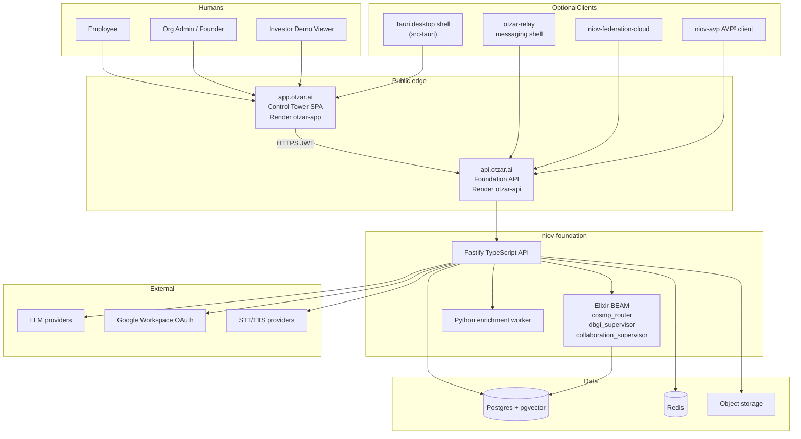

# OTZAR — System Context Diagram

**Verified 2026-07-27** against live health + repo layout.

## Context (C4 L1)

## Trust boundaries

| Boundary | Rule |
|----------|------|
| Browser → API | Bearer JWT; no JWT in localStorage |
| Tenant A ↔ Tenant B | Org-scope predicates + GOVSEC isolation tests |
| Human ↔ AI Twin | Twin authority grants; lower AI ceilings |
| Foundation ↔ CT | HTTP contracts only; CT must not invent authority |
| Otzar ↔ Relay | Relay is UX; Foundation is policy/truth |
| Otzar ↔ Caretaker | **Hard isolation** — separate products/repos |
